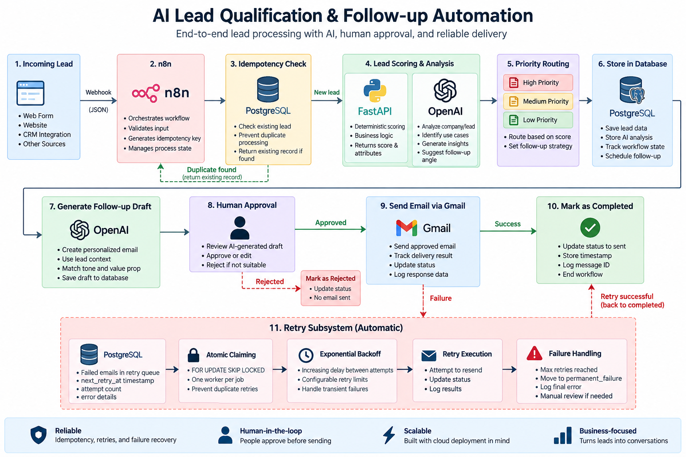

# AI Lead Qualification & Follow-up Automation

An end-to-end lead qualification and follow-up automation system built with n8n, FastAPI, PostgreSQL, OpenAI, and Gmail.

The system receives incoming leads, prevents duplicate processing, performs deterministic lead scoring and AI-assisted business analysis, generates personalized follow-up drafts, requires human approval before email delivery, and automatically handles transient delivery failures with controlled retries.

## Architecture



## Core Features

- Webhook-based lead ingestion
- Idempotency protection against duplicate requests
- Deterministic lead scoring with Python and FastAPI
- AI-assisted lead analysis
- Priority-based lead routing
- PostgreSQL persistent state
- AI-generated follow-up drafts
- Human-in-the-loop approval before email delivery
- Gmail integration
- Retry handling with backoff
- Atomic retry claiming for concurrency safety
- Retry limits and permanent-failure handling
- Recovery of stale retry jobs

## Technology Stack

- **n8n** — workflow orchestration
- **Python / FastAPI** — deterministic lead-scoring service
- **PostgreSQL** — persistent workflow and lead state
- **OpenAI** — lead analysis and follow-up generation
- **Gmail** — approved follow-up delivery
- **Docker** — local service runtime
- **Git / GitHub** — version control and project hosting

## Project Structure

```text
ai-lead-qualification-automation/
├── README.md
├── .env.example
├── database/
│   └── schema.sql
├── docs/
│   └── screenshots/
├── lead-scoring-api/
│   ├── main.py
│   └── requirements.txt
└── workflows/
    ├── lead-processing.json
    ├── followup-approval.json
    └── retry-failed-followups.json


## Local Development

### Prerequisites

Before running the project, make sure the following are installed:

- Docker and Docker Compose
- Git
- An OpenAI API account for the AI workflow nodes
- A Gmail account or compatible n8n Gmail credential for email delivery

### 1. Clone the Repository

```bash
git clone https://github.com/humam-h/ai-lead-qualification-automation.git
cd ai-lead-qualification-automation

