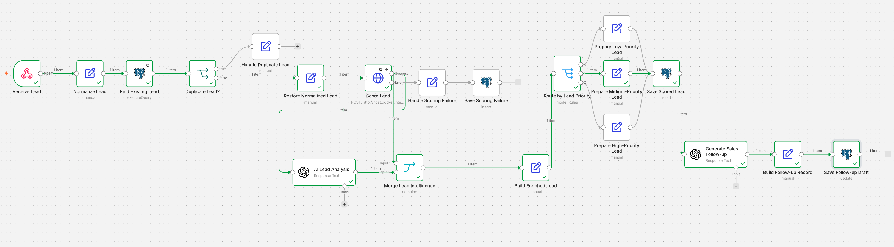
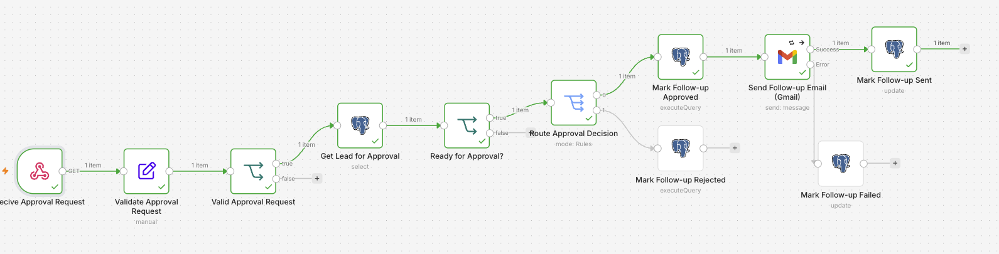

# AI Lead Qualification & Follow-up Automation

An end-to-end lead qualification and follow-up automation system built with n8n, FastAPI, PostgreSQL, OpenAI, and Gmail.

The system receives incoming leads, prevents duplicate processing, performs deterministic lead scoring and AI-assisted business analysis, generates personalized follow-up drafts, requires human approval before email delivery, and automatically handles transient delivery failures with controlled retries.

## Architecture


## Core Features

- Webhook-based lead ingestion
- Idempotency protection against duplicate requests
- Deterministic lead scoring with Python and FastAPI
- AI-assisted lead analysis
- Priority-based lead routing
- PostgreSQL persistent state
- AI-generated follow-up drafts
- Human-in-the-loop approval before email delivery
- Gmail integration
- Retry handling with backoff
- Atomic retry claiming for concurrency safety
- Retry limits and permanent-failure handling
- Recovery of stale retry jobs

## Technology Stack

- **n8n** — workflow orchestration
- **Python / FastAPI** — deterministic lead-scoring service
- **PostgreSQL** — persistent workflow and lead state
- **OpenAI** — lead analysis and follow-up generation
- **Gmail** — approved follow-up delivery
- **Docker** — local service runtime
- **Git / GitHub** — version control and project hosting

## Project Structure

```text
ai-lead-qualification-automation/
├── README.md
├── .env.example
├── database/
│   └── schema.sql
├── docs/
│   └── screenshots/
├── lead-scoring-api/
│   ├── main.py
│   └── requirements.txt
└── workflows/
    ├── lead-processing.json
    ├── followup-approval.json
    └── retry-failed-follow.json
```

## Business Use Case

Many small and medium-sized businesses receive leads through website forms, email, or other channels but still rely on employees to manually review, qualify, and respond to every enquiry.

This project demonstrates how that process can be automated while keeping human control over customer communication.

### Example Workflow

A new prospect submits an enquiry describing their business and what they are interested in.

The system automatically:

1. Checks whether the request has already been processed.
2. Scores the lead using deterministic business rules.
3. Uses AI to analyze the prospect's business need and objective.
4. Generates relevant discovery questions.
5. Assigns a lead priority and recommended action.
6. Creates a personalized follow-up email.
7. Holds the email for human approval.
8. Sends the approved email through Gmail.
9. Records the resulting state in PostgreSQL.
10. Retries transient email failures using controlled backoff.

Duplicate requests are detected using an idempotency key and are skipped before expensive scoring or AI processing occurs.

## Demo Scenario

The portfolio demo uses a fictional IT services company receiving an enquiry from a logistics business that wants to reduce the amount of time its support team spends answering repetitive delivery questions.

### Lead Processing Workflow

The main workflow handles lead intake, duplicate detection, deterministic scoring, AI-assisted analysis, priority routing, persistence, and follow-up generation.



```text
Customer Enquiry
       |
       v
Idempotency Check
       |
       v
Lead Scoring
       |
       v
AI Business Analysis
       |
       v
Follow-up Generation
       |
       v
Human Approval
       |
       v
Email Delivery
```

The generated follow-up remains in `awaiting_approval` until a human explicitly approves it.

### Human Approval Workflow

AI-generated follow-ups require explicit human approval before customer communication is sent.




After successful delivery, the lead moves to `sent`.

Submitting the same request again demonstrates the system's idempotency protection: the duplicate is detected and skipped rather than generating another AI response or customer email.

## Reliability Features

The project includes several safeguards intended to make the automation more reliable than a simple AI-to-email workflow:

* Persistent workflow state in PostgreSQL
* Unique idempotency keys
* Human approval before external communication
* Explicit scoring and email failure states
* Controlled email retry attempts
* Retry backoff
* Atomic retry claiming
* Stale retry recovery
* Permanent failure handling
* Docker health checks
* Automatic container restart policies

## Local Development

### Prerequisites

Before running the project, make sure the following are installed:

- Docker and Docker Compose
- Git
- An OpenAI API account for the AI workflow nodes
- A Gmail account or compatible n8n Gmail credential for email delivery

### 1. Clone the Repository

```bash
git clone https://github.com/humam-h/ai-lead-qualification-automation.git
cd ai-lead-qualification-automation
```

### 2. Configure Environment Variables

Create a local environment file:

```bash
cp .env.example .env
```

Configure the PostgreSQL values in `.env`:

```env
POSTGRES_DB=automation
POSTGRES_USER=automation
POSTGRES_PASSWORD=choose_a_secure_password

LEAD_SCORING_API_PORT=8000
```

The `.env` file is excluded from Git and should never be committed.

### 3. Start the Application Stack

```bash
docker compose up -d --build
```

Check service status:

```bash
docker compose ps
```

The stack provides:

- PostgreSQL on port `5432`
- Lead Scoring API on port `8000`
- n8n on port `5678`

### 4. Open n8n

Open `http://localhost:5678` in a browser and complete the initial n8n setup if required.

Import the workflow definitions from the `workflows/` directory:

- `lead-processing.json`
- `followup-approval.json`
- `retry-failed-followups.json`

### 5. Configure n8n Credentials

Configure credentials inside n8n for:

- PostgreSQL
- OpenAI
- Gmail

For PostgreSQL, use the Compose service name as the hostname:

```text
Host: postgres
Port: 5432
Database: automation
```

Use the PostgreSQL username and password configured in `.env`.

The lead-processing workflow communicates with FastAPI over the internal Docker network using:

```text
http://lead-scoring-api:8000/score-lead
```

### 6. Verify the Lead Scoring API

Check application health:

```bash
curl http://localhost:8000/health
```

Expected response:

```json
{"status":"healthy"}
```

You can also verify the full Compose stack:

```bash
docker compose ps
```

PostgreSQL and the Lead Scoring API should report as healthy.

### 7. Stop the Environment

Stop the containers while preserving persistent data:

```bash
docker compose down
```

Start them again with:

```bash
docker compose up -d
```

PostgreSQL and n8n state are stored in persistent Docker volumes.
